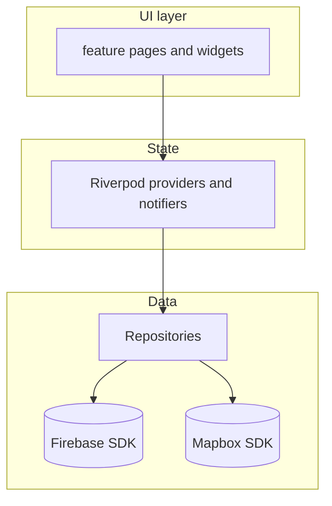

# FilmTrace HK · 港片映迹 (Public Showcase)

**Hong Kong film location discovery and LBS check-in — client architecture demonstration.**

---

## Public showcase notice

> **This is a public showcase version. The full source code is private due to proprietary business logic/IP protection.**

> Map credentials, backend configuration, and production data are not included; clone this repository to study structure and patterns only.

---

## English

### Project Overview

**FilmTrace HK** is a location-based (LBS) mobile application for **Hong Kong cinema filming-location discovery and check-ins**. It connects on-screen fiction with real streets: users explore spots on an interactive map, open location pages with stills and quotes, check in when nearby, and create **polaroid-style composites** to save or share. A **fan circle** feed supports authenticated posts for community discovery around film geography.

The codebase demonstrates **clean client architecture**: **Riverpod** for state, **GoRouter** for navigation, **Firebase** (Auth, Firestore, Storage) for services, and **Mapbox** for mapping—organized under `lib/features/`.

### User Pain Points

| Pain point | How the app addresses it |
|------------|----------------------------|
| “Where was this scene shot?” is hard to answer from generic maps. | Map-first discovery with **film-linked locations**, stills, and metadata. |
| Location knowledge is **fragmented** across blogs and social posts. | A **single structured** experience: discovery tabs, search, map-to-detail flow. |
| Visiting a location lacks a **shareable proof of presence**. | **Proximity check-in** and **polaroid-style** composites tuned for sharing. |
| Fans want **community** around HK film geography. | **Authenticated feed** (fan circle): posts, interactions, profiles. |
| LBS + camera apps often mix **business logic into widgets**. | **Repositories and notifiers** own I/O; UI stays declarative (`ref.watch`). |

### Tech Stack

| Layer | Technology |
|--------|------------|
| Framework | Flutter (Dart ≥ 3.2), Material 3 |
| State | `flutter_riverpod` |
| Routing | `go_router` |
| Backend | Firebase Core, Auth, Cloud Firestore, Firebase Storage |
| Maps & location | Mapbox Maps Flutter, Geolocator, `permission_handler` |
| Camera & imaging | `camera`, `image`, `image_gallery_saver`, `share_plus` |
| Models | `freezed` + `json_serializable` |

### Key Features

- Map experience: basemap, viewport markers, location sheets.
- Location detail: films, quotes, stills; distance-aware check-in.
- Discovery: recommendations, films, talent; search and navigation.
- Camera workflow: landscape capture, still overlay, polaroid export.
- Account & fan circle: email sign-in, feed, posts, interactions (requires your Firebase project).
- Theming: centralized dark “neon” visual language via shared theme constants.

---

## Français

### Project Overview

**FilmTrace HK** est une application mobile **géolocalisée (LBS)** pour la **découverte et le check-in des lieux de tournage** du cinéma hongkongais. Elle relie la fiction à l’espace réel : carte interactive, fiches lieux (photogrammes, répliques), **check-in de proximité**, **souvenirs façon polaroid**, et un **fil « cercle de fans »** pour une découverte sociale autour du patrimoine filmique.

Architecture client : **Riverpod**, **GoRouter**, **Firebase**, **Mapbox**, organisation par **`lib/features/`**.

### User Pain Points

| Difficulté | Réponse |
|------------|---------|
| « Où la scène a-t-elle été tournée ? » — info **éparse** sur les cartes génériques. | Découverte **cartographique** avec lieux **liés aux films** et métadonnées. |
| Connaissances **fragmentées** (blogs, réseaux). | **Parcours unifié** : onglets découverte, recherche, carte → détail. |
| Visite sans **preuve partageable** du passage. | **Check-in** et **composites polaroid**. |
| Besoin de **communauté** autour des lieux. | **Fil authentifié** : publications, interactions. |
| Risque de logique **mélangée à l’UI**. | **Dépôts / notifiers** ; UI **déclarative**. |

### Tech Stack

| Couche | Technologie |
|--------|-------------|
| Framework | Flutter (Dart ≥ 3.2), Material 3 |
| État | `flutter_riverpod` |
| Routage | `go_router` |
| Backend | Firebase (Core, Auth, Firestore, Storage) |
| Carte | Mapbox Maps Flutter, Geolocator, `permission_handler` |
| Caméra | `camera`, `image`, `image_gallery_saver`, `share_plus` |
| Modèles | `freezed`, `json_serializable` |

### Key Features

- Carte, marqueurs, fiches lieu.
- Détail lieu : films, citations, check-in par distance.
- Découverte : onglets, recherche.
- Caméra et polaroid : composition, album, partage.
- Compte et cercle de fans (Firebase requis).
- Thème sombre « néon » centralisé.

---

## 中文

### Project Overview

**港片映迹 FilmTrace HK** 是一款 **香港电影取景地** 的 **LBS 移动应用**：在地图上发现拍摄点，查看剧照与台词、**近距打卡**，并生成 **拍立得风** 成片用于保存与分享；**影迷圈** 提供登录用户动态与轻量社交。

客户端采用 **Riverpod**、**GoRouter**、**Firebase**、**Mapbox**，按 **`lib/features/`** 功能划分，业务与 UI 分离。

### User Pain Points

| 痛点 | 应对 |
|------|------|
| 「在哪拍？」在通用地图上 **难对应**。 | **地图优先** 的取景地与元数据展示。 |
| 资料 **分散** 在各平台。 | **统一路径**：发现、搜索、地图到详情。 |
| 缺少 **可分享的在场证明**。 | **距离打卡** + **拍立得合成**。 |
| 影迷需要 **社群感**。 | **影迷圈** 动态（需自建 Firebase）。 |
| 易把 **业务写进 Widget**。 | **Repository / Notifier**；UI **声明式**。 |

### Tech Stack

| 层级 | 技术 |
|------|------|
| 框架 | Flutter（Dart ≥ 3.2），Material 3 |
| 状态 | `flutter_riverpod` |
| 路由 | `go_router` |
| 后端 | Firebase（Auth、Firestore、Storage） |
| 地图 | Mapbox Maps Flutter、Geolocator、`permission_handler` |
| 相机 | `camera`、`image`、`image_gallery_saver`、`share_plus` |
| 模型 | `freezed`、`json_serializable` |

### Key Features

- 地图、标记、取景地信息。
- 详情页、近距打卡、名场面入口。
- 光影检索、搜索与跳转。
- 相机与拍立得合成、保存与分享。
- 账号与影迷圈（需配置 Firebase）。
- 深色霓虹主题体系统一管理样式。

---

## How to run

Prerequisites: Flutter SDK ≥ 3.2; Xcode or Android SDK for mobile.

```bash
cd filmtrace_hk_showcase
flutter pub get
```

**Mapbox (required for map tiles):** obtain a **public** access token from [Mapbox](https://account.mapbox.com/access-tokens/), then:

```bash
flutter run --dart-define=MAPBOX_ACCESS_TOKEN=YOUR_PUBLIC_TOKEN
```

Do **not** commit tokens. This repo ships with **empty** native Mapbox slots; pass the token at run time or inject locally (not for public commit).

**Firebase:** `lib/firebase_options.dart` is a **placeholder stub**. Replace it by running:

```bash
dart pub global activate flutterfire_cli
flutterfire configure
```

Add platform files (`GoogleService-Info.plist`, `google-services.json`) **locally**; they are **not** included here. Until configured, Auth/Firestore features may not work; the map can still use **mock location data** where implemented.

---

## Architecture (high level)



```
lib/
├── main.dart
├── app_shell.dart
├── core/          # theme, routing, auth, shared providers
└── features/      # map, discovery, camera, share, feed, auth, ...
```

---

## License

This showcase is released under the [MIT License](LICENSE). Sample data and placeholders are illustrative only.
